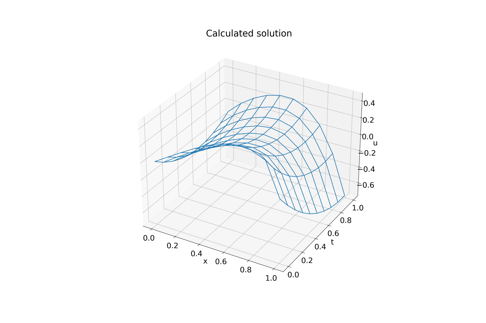
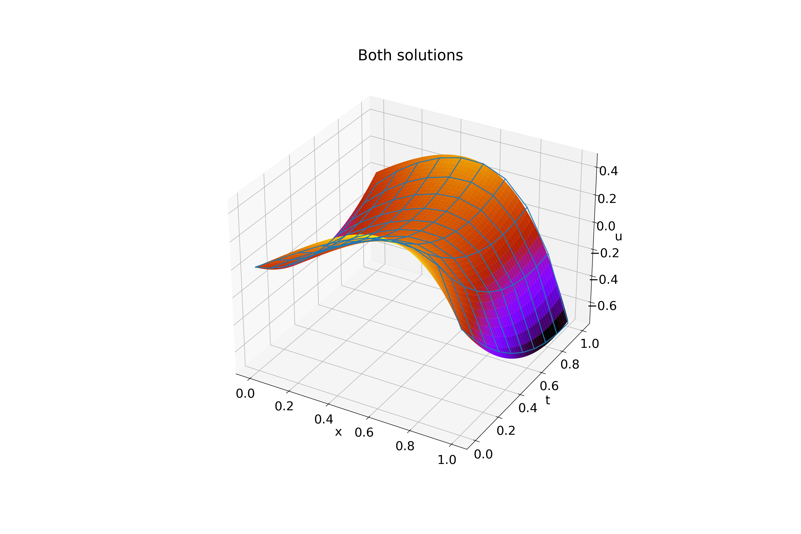

#

Input:
```shell
tau (use decimal repr): 0.1
h (use decimal repr): 0.1
Solving (time layer): ████████████████████████████████ 100%

Max error: 0.38671084557188573
tau + h^2 = 0.11000000000000001
Elapsed time: 0:00:00.001795
```

Exact solution (on uniform grid, `tau`=0.0001, `h`=0.0001):


Calculated solution:



Both solutions:


