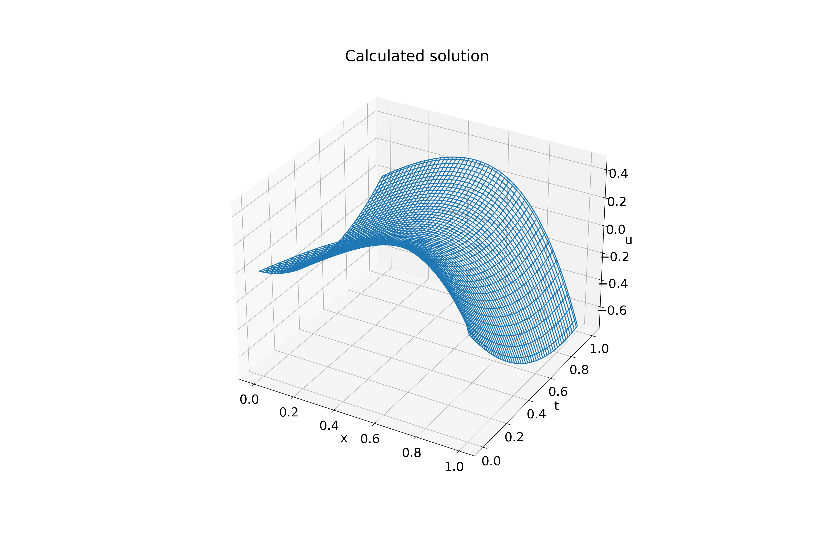
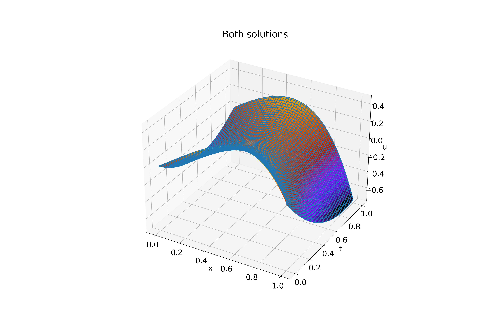

#

Input:
```shell
tau (use decimal repr): 0.01
h (use decimal repr): 0.01
Solving (time layer): ████████████████████████████████ 100%

Max error: 0.04628087254868518
tau + h^2 = 0.0101
Elapsed time: 0:00:00.047907
```

Exact solution (on uniform grid, `tau`=0.0001, `h`=0.0001):


Calculated solution:



Both solutions:


