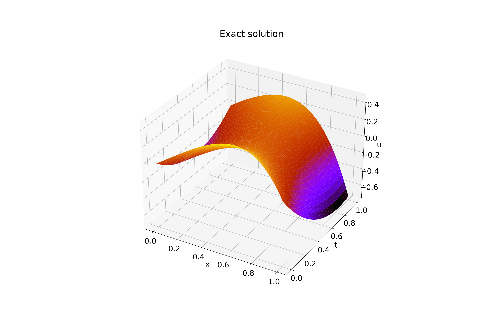
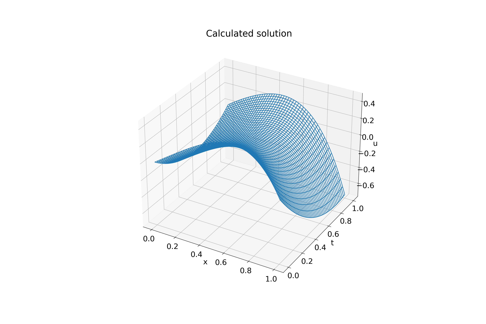
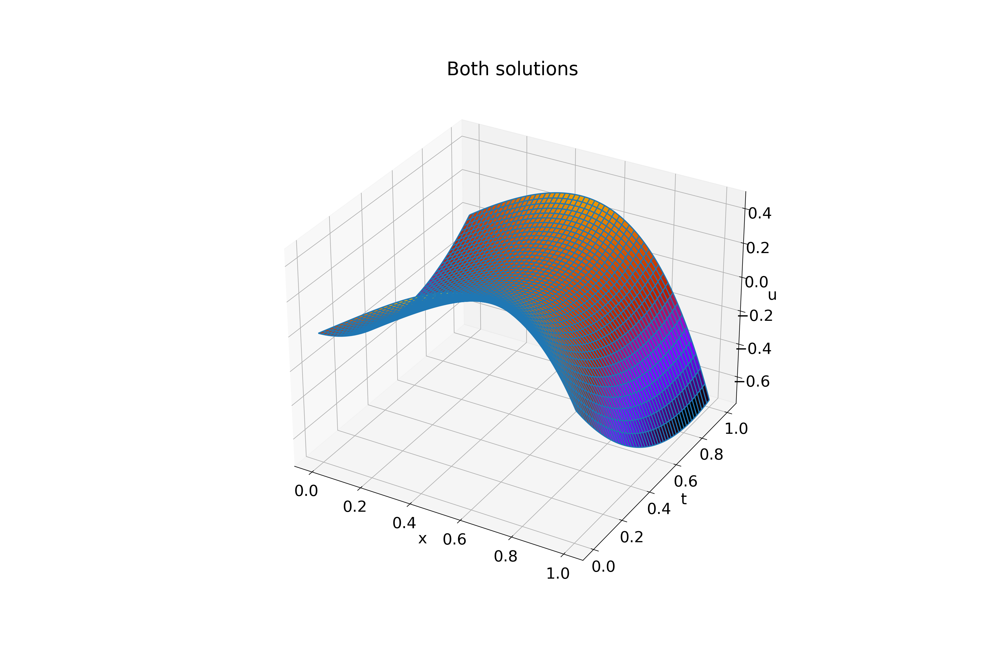

#

Input:
```shell
tau (use decimal repr): 0.0001
h (use decimal repr): 0.0001
Solving (time layer): ████████████████████████████████ 100%

Max error: 0.00047173741443007344
tau + h^2 = 0.00010001
Elapsed time: 0:03:10.011009
```

Exact solution (on uniform grid, `tau`=0.0001, `h`=0.0001):



Calculated solution:



Both solutions:


