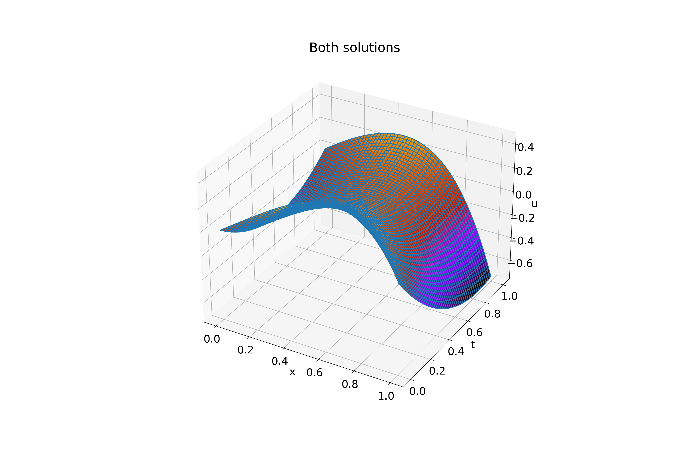

#

Input:
```shell
tau (use decimal repr): 0.005
h (use decimal repr): 0.005
Solving (time layer): ████████████████████████████████ 100%

Max error: 0.023365199118695168
tau + h^2 = 0.005025
Elapsed time: 0:00:00.116882
```

Exact solution (on uniform grid, `tau`=0.0001, `h`=0.0001):


Calculated solution:


Both solutions:


