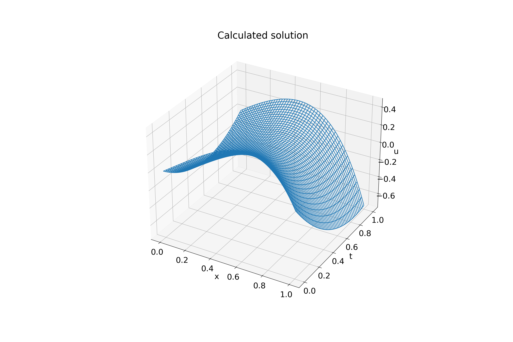
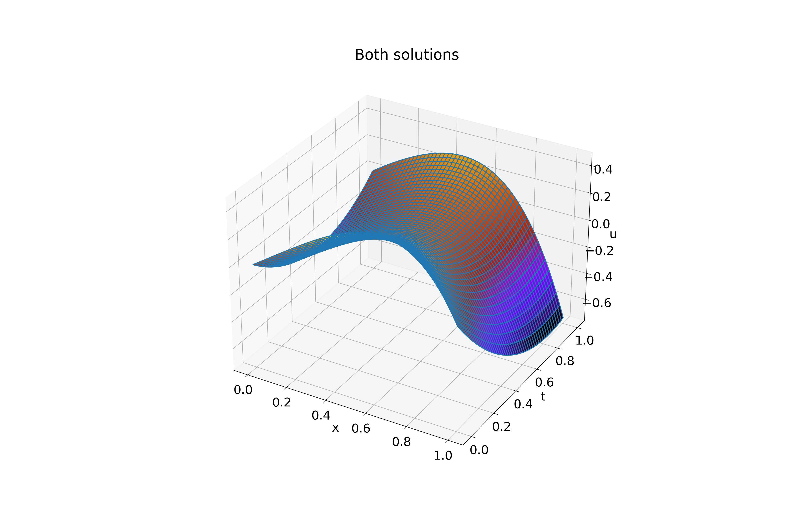

#

Input:
```shell
tau (use decimal repr): 0.0005
h (use decimal repr): 0.0005
Solving (time layer): ████████████████████████████████ 100%

Max error: 0.002356872284968725
tau + h^2 = 0.00050025
Elapsed time: 0:00:07.633175
```

Exact solution (on uniform grid, `tau`=0.0001, `h`=0.0001):


Calculated solution:



Both solutions:


