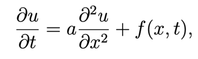
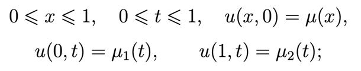
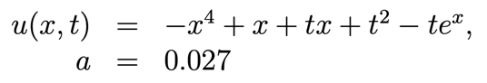

# Heat equation

## Overview

Here is the [implicit scheme for the one-dimensional heat equation](https://people.sc.fsu.edu/~jpeterson/4-Implicit.pdf)

Input values are: `tau` (step by t-axis) and `h` (step by x-axis)

I didn't test it for `tau < 0.0001` and `h < 0.0001`, it takes a lot of time

For `tau=0.0001` and `h=0.0001` it takes ~200 seconds

## Demo

One-dimensional heat equation:

Initial conditions:

Exact solution and `a`:

There are links below to graphs and calculations for this demo-equation on different uniform grids (for different `tau` and `h`):

1. `tau`=0.1, `h`=0.1 => [here](./graphs/10)
2. `tau`=0.01, `h`=0.01 => [here](./graphs/100)
3. `tau`=0.005, `h`=0.005 => [here](./graphs/200)
4. `tau`=0.001, `h`=0.001 => [here](./graphs/1000)
5. `tau`=0.0005, `h`=0.0005 => [here](./graphs/2000)
6. `tau`=0.0001, `h`=0.0001 => [here](./graphs/10000)